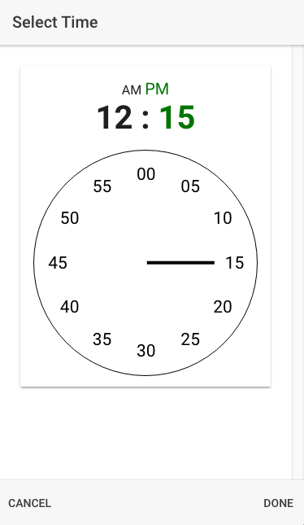

# Ionic Timepicker Starter

This is a an Ionic 3 starter template demonstrating a simple, responsive
timepicker based on the Android TimePicker widget.

## Getting started

`$ git clone https://github.com/syndesis/ionic-starter-timepicker`

### Prerequistes

* npm or yarn

### Installing

`$ npm install`

OR

`$ yarn`

## Built With

* Ionic
* Angular

## Authors

* Frank Sheiness

## License

This project is licensed under the MIT License - see the LICENSE file for details.
